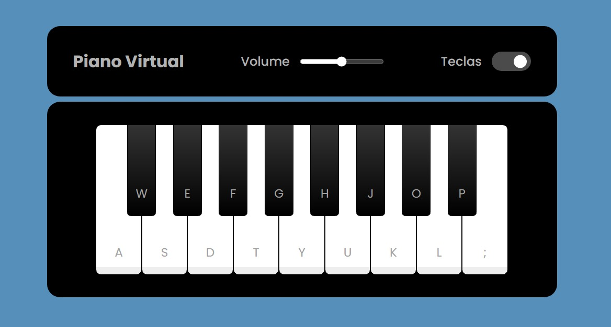

  

# Simulador de Piano Virtual

Teste seus talentos musicais com esse simulador de piano virtual! Use o mouse ou as teclas do teclado para criar seu som.

No desenvolvimento desse jogo pude aplicar os conhecimentos em manipulação de DOM através do JavaScript, além da implementação de recursos multimídia, como efeitos sonoros, elementos personalizados, animações e interação com HTML por meio do teclado.

## Tecnologias Utilizadas:

## Funcionalidades:

- Controle de volume;
- Uso do teclado para manipular a página;
- Efeitos sonoros;
- Toggle menu;
- Exibição e ocultação de elemetos dinamicamente.

## Aprendizados com esse projeto:

1. Manipulação de DOM com JavaScript
2. Transições e efeitos de transformação com CSS
3. Implementação multimídia
4. Retorno visual de acordo com a atividade do usuário

## Como usar o teclado:

Para tocar o piano virtual basta clicar <a href="https://juniord-dev.github.io/js-piano-simulator/" target="_blank">AQUI</a>!

## A ser implementado:

1. Retorno visual de ondas sonoras de acordo com as teclas acionadas;
2. Manual para criar melodias simples com o teclado;
3. Animações diferentes para cada tecla acionada;
4. Sons de instrumentos diferentes.

### Créditos:
---

Este jogo foi desenvolvido como parte de um projeto educacional da Digital Innovation One (DIO).

##

Feito por <a href="https://github.com/juniord-dev">Junior Dantas</a>.

